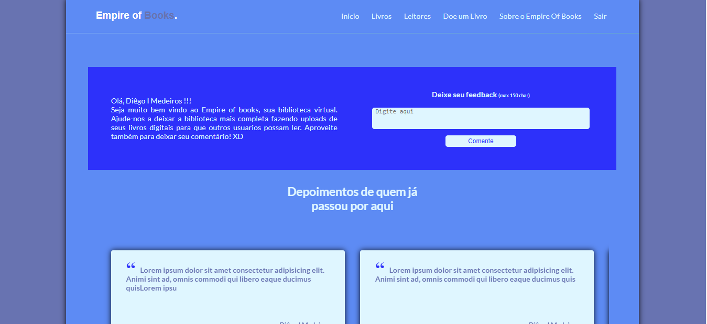
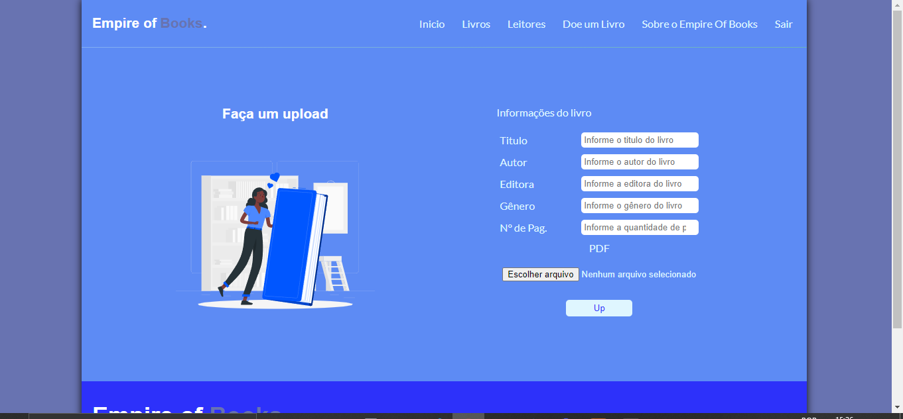
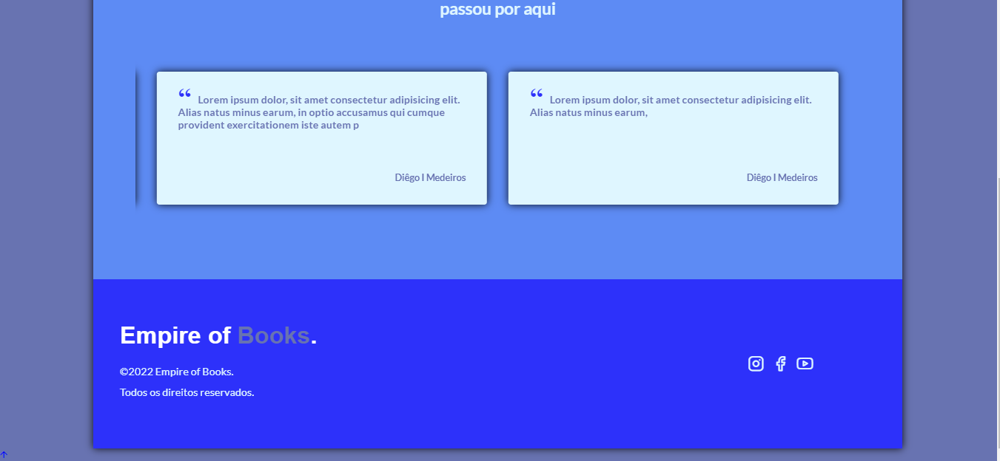

# Empire of Books

  <a href="#sobre">Sobre</a>&nbsp;&nbsp;&nbsp;|&nbsp;&nbsp;&nbsp;
  <a href="#tecnologias-utilizadas">Tecnologias utilizadas</a>&nbsp;&nbsp;&nbsp;|&nbsp;&nbsp;&nbsp;
  <a href="#como-rodar">Como rodar?</a>&nbsp;&nbsp;&nbsp;|&nbsp;&nbsp;&nbsp;
  <a href="#licença-e-autores">Autore</a>

## Sobre

- Uma aplicação com 5 paginas onde é possivel upar um livro (PDF), baixar os livros já
  existentes e deixar comentários. Também é preciso fazer um cadastro para poder acessar a aplicação;
- Projeto das disciplinas de POO e Autoria Web de 2019;

### Algumas telas da versão de desktop

  _Tela de login:_

  

  _Tela inicial:_

  

  _Telas de upload de livros:_

  

  _Footer:_

  

## Tecnologias utilizadas

Este projeto foi desenvolvido utilizando as seguintes tecnologias:

### 💻 Front-end

- [HTML](https://developer.mozilla.org/pt-BR/docs/Web/HTML)
- [CSS](https://developer.mozilla.org/pt-BR/docs/Web/CSS)
- [JavaScript](https://www.javascript.com/)

### 💻 Back-end

- [PHP](https://www.php.net/)

## Como rodar?

- Para rodar essa aplicação, caso esteja no Windows, é preciso instalar o [xampp](https://www.apachefriends.org/pt_br/index.html);
- O diretório deve estar na pasta htdocs que está dentro da pasta xammp;
- Sempre que for executar a aplicação é preciso abrir o xampp e startar o apache;
- Com o apache estartado abra o browser e digite: localhost/caminhododiretorio.

## To do

Algumas ideias para melhorar a aplicação:

- Adicionar um tema dark.
- Adicionar uma seção de feedback para cada livro.

- Sinta-se livre para sugerir novas melhorias e correções [criando uma issue](https://github.com/DiegoImperiano/empire-of-books/issues/new) 😉.

## Licença e Autores

